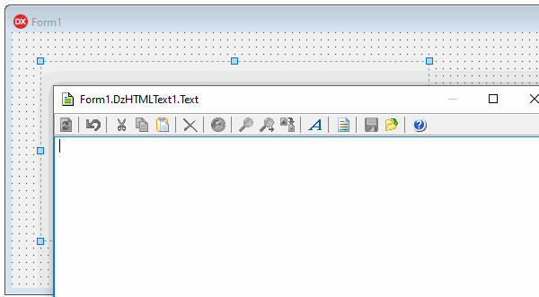
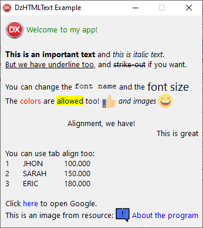
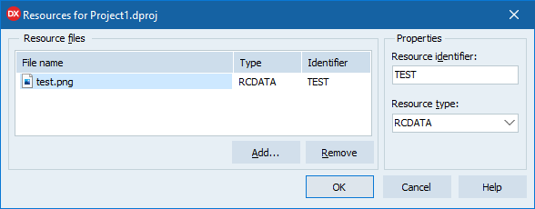

# DzHTMLText
## Delphi and Lazarus HTML Label component


[](https://ko-fi.com/C0C53LVFN)

- [What's New](#whats-new)
- [Component Description](#component-description)
- [Installing](#installing)
- [Component Properties](#component-properties)
- [Events](#events)
- [Procedures/Functions](#proceduresfunctions)
- [Link Reference Tag](#link-reference-tag)
- [Spoiler Tag](#spoiler-tag)
- [Link object](#link-object)
- [Image Tag](#image-tag)
- [Tab Tag](#tab-tag)
- [Float Tag](#float-tag)
- [Literal tag character](#literal-tag-character)
- [Chinese/Japanese/Korean line break](#chinesejapanesekorean-line-break)
- [Transparency (why not in VCL?)](#transparency-why-not-in-vcl)
- [Formatted Message Dialog Component](#formatted-message-dialog-component)
- [Donate](#donate)

## What's New

- 03/05/2021 (Version 3.1)

   - Fixed OnLinkClick event error when returning from event handler, if link is no longer selected.

- 02/10/2021 (Version 3.0)

   - **FMX support!**
   - Color notation now supports 6-digit (HTML) and 8-digit (Delphi) format, prefixed `#` or `$`.
   - Transparent support for FMX environment (Use Color = Null).
   - Multiple image format when using Resources in FMX environment.
   - *FMX Remarks:*
      - Images property (ImageList) only available for Delphi XE8 or higher (using always first Layer in ImageList).
      - AutoOpenLink property only works in Windows, Linux and Android environments (not available in iOS and MacOS).
   - **Warning: VCL unit changed from DzHTMLText to Vcl.DzHTMLText. If you are not using "Vcl" in Unit Scope Names property in Delphi Compiler options, please review your "uses" clauses.**
   - Removed Delphi XE2 from the list of environments as it was never possible to compile in this version.
   - Fixed Linux compatibility (Paint method, platform specific LineBreak, Link Text capture causing error).
   - Fixed AutoOpenLink to do nothing when there is no target on link.
   - Fixed AutoWidth and AutoHeight to repaint correctly according to calculated text positions.

- 12/18/2020 (Version 2.11)

   - Updated Component Installer app (Fixed call to rsvars.bat when Delphi is installed in a path containing spaces characters).

- 11/03/2020 (Version 2.10)

   - Implemented new `<sup>` and `<sub>` tags.
   - Fixed to not break line in the middle of a word when using tags inside the word.
   - Fixed Lazarus Bullet symbol.
   - New internal exception class.

- 10/31/2020 (Version 2.9)

   - Included Delphi 10.4 auto-install support.

- 10/27/2020 (Version 2.8)

   - Fixed previous Delphi versions (at least on XE2, XE3, XE4 and XE5) package tag. It was causing package compilation error.
   - Fixed the use of System.ImageList unit in Demo project because it's only available from XE8.
   - Fixed internal .ToString conversion because is not available at some Delphi versions.

- 10/27/2020 (Version 2.7)

   - Fixed incorrect Unicode characters on Lazarus (issue #31).

- 10/26/2020 (Version 2.6 *version format reverted to original*)

   - Implemented internal Version Control used by TDam component to synchronize TDzHTMLText dependency.

- 10/26/2020 (Version 2.05)

   - Updated CompInstall to version 2.0 (now supports GitHub auto-update)

- 10/18/2020 (Version 2.04 *changed version format*)

   - Since the Dam component depends on this component and it needs to know its version, an internal version constant has been added, and the format of About property has been changed from "0.0" to "0.00", where the previous version was 2.3 and now the version is 2.04.

- 10/14/2020

   - Removed Lazarus warnings.

- 08/30/2020 (Version 2.3)

   - Included overall align properties.

- 08/03/2020

   - Fixed Lazarus extra line break (issue #23).
   - Fixed Delphi unsupported property TrailingLineBreak (only available in Delphi 10.1).
   - Fixed Delphi unsupported method TPoint.Zero (Delphi XE7 and below?).

- 08/02/2020
  
   - Included donate button. Consider making a donation if the project is useful to you.

- 07/31/2020 (Version 2.2)

   - Add a new tag `<LS>` for line spacing.

- 07/30/2020 (Version 2.1)

   - Implemented new Lines (TStrings) property and removed Text published property. :warning:
   - Implemented Text (String) public property as a shortcut to new Lines property. :warning:
   - Changed Lines (Integer) property name to LineCount. :warning:

     | :exclamation: Component property change. Risk of data loss! |
     |-------------------------------------------------------------|

     In order to keep TDzHTMLText Text string property content of your projects, you'll need to manually change property on DFM file, before opening projects in Delphi.
     Open the DFM files (using a text editor) that contains TDzHTMLText objects and replace as in the example:

     ```delphi
     object DzHTMLText1: TDzHTMLText
	   //FROM:
       Text = 'Line 1'#13#10'Line 2'#13#10'Line 3'
	   //TO:
       Lines.Strings = (
         'Line 1'#13#10'Line 2'#13#10'Line 3')
     end
     ```

     If you want to keep old Text property, please download the older version here: [TDzHTMLText v2.0](https://github.com/digao-dalpiaz/DzHTMLText/releases/tag/v2.0)

- 07/27/2020 (Version 2.0)

   - Refactoring in all the methods that process the tokens.
   - Improvement in the use of memory keeping in the objects that are used for visual construction only the necessary properties. For that, the internal properties were moved to new classes.
   - Implemented full alignment support when using tab tags.
   - Fixed multiple space strange behavior on line break.
   - Fixed when there was only one word on the line and the limit was less than it, which caused the word to skip the line.
   - New tag `<float>`, allowing you to create floating panels with content in free positions. :smile: :smile: :smile:
   - Implemented class functions to Escape and Unescape HTML text.
   - Included `&` (`&amp;`) unescape in internal reading of HTML text.
   - New tag `<spoiler>` and `<sdetail>`, creating closed/expanded div. :smile: :smile: :smile:
   - TDHLinkData removed and link events signature changed!!! **It is necessary to adjust the implemented methods for compatibility.** :warning:
   
      Removed:
	  - property SelectedLinkID
	  - function GetLinkData
	  - function GetSelected
	  
	  Please, use new `GetSelectedLink` property and `LinkRefs` list (*there is no longer the concept of link ID!*).

- 07/15/2020

   - Fixed lists bullet char for Lazarus - issue #16.

- 07/10/2020

   - Fixed TObjectList (generics) declaration for Lazarus 2.0.10 - issue #14.

- 05/24/2020

   - Included HTML lists tag support (`<ul>`, `<ol>`, `<li>`)
   - Implemented `<nbr>` tag to avoid line break when there is #13#10 sequence, because this sequence is automatically converted in HTML line break by the component.

- 05/03/2020

   - Included vclimg.dcp reference into package
   - Updated CompInstall to version 1.2

- 04/27/2020

   - Changed version to 1.2
   - Implemented OnRetrieveImgRes event to manually load images when using `<imgres>` tag.

- 04/26/2020

   - Included IMGRES tag, supporting PNG resource images.

- 04/10/2020

   - Support Chinese, Japanese and Korean line break - issue #8

- 03/09/2020

   - Fix AutoWidth bug using incorrect component Width - issue #7

- 03/01/2020

   - Add BeginUpdate/EndUpdate feature.
   - Move Rebuild procedure to public session.
   - Fix redundant call to rebuild on component bounds resized by auto-properties.

- 02/15/2020

   - Add line vertical-align property.
   - Add image support, based on ImageList. :art:

- 06/03/2019

   - Lazarus support. Thanks to @jackdp. :grin:

- 02/21/2019

   - Changed events to support Link display text. :warning:

- 02/11/2019

   - Include auto-install app

- 02/08/2019

   - Component renamed. Please fully uninstall the previous version before installing this version. :warning:
   
      *The component was renamed because of other commercial component conflict.*

- 02/07/2019

   - Add Win64 support (library folders changed!) :warning:

## Component Description

This visual component allows you to specify a formatted text in a label, using almost the same syntax used in HTML code.

Here are all possible tags you can use in text:

```
<A[:abc]></A> - Link
<B></B> - Bold
<I></I> - Italic
<U></U> - Underline
<S></S> - Strike out
<FN:abc></FN> - Font Name
<FS:123></FS> - Font Size
<FC:clColor(VCL)|Color(FMX)|$123456|$12345678|#123456|#12345678></FC> - Font Color
<BC:clColor(VCL)|Color(FMX)|$123456|$12345678|#123456|#12345678></BC> - Background Color
<BR> - Line Break
<NBR> - Prevent line break after #13#10 sequence
<L></L> - Align Left
<C></C> - Align Center
<R></R> - Align Right
<T:123> - Tab
<TF:123> - Tab with aligned break
 - Image from ImageList where 'nnn' is image index
<IMGRES:name> - PNG image from Resource where 'name' is the resource name
<UL></UL> - Unordered list
<OL></OL> - Ordered list
<LI></LI> - List item
<FLOAT:X,Y[,Width]></FLOAT> - Floating area
<SPOILER:name></SPOILER> - Spoiler Title
<SDETAIL:name></SDETAIL> - Spoiler Detail
<LS:nnn></LS> - Line spacing where 'nnn' is the height in pixels
<SUP></SUP> - Superscript
<SUB></SUB> - Subscript
```

> The tags notation is case-insensitive, so you can use `<B>Text</B>` or `<b>Text</b>`.



## Installing

> If you are using Lazarus: go to the Package menu; Open Package File (.lpk); locate LazDzHTMLText.lpk; open the package; Compile it and Install it.

### Autoinstall

Close Delphi IDE and run **CompInstall.exe** app to auto install component into Delphi.

### Manual install

1. Open **DzHTMLText.groupproj** project in Delphi.
2. Ensure **Win32** Platform and **Release** config are selected in VCL and FMX packages.
3. Then **Build** and **Install** all packages.
4. If you want to use Win64 platform, select this platform and Build again.
5. Add sub-path Win32\Release to the Library paths at Tools\Options using 32-bit option, and if you have compiled to 64 bit platform, add sub-path Win64\Release using 64-bit option.

Supports Delphi XE3..Delphi 10.4

## Component Properties

`AutoHeight: Boolean` = Auto set height of control when Text property changed

`AutoWidth: Boolean` = Auto set width of control when Text property changed.
If you are using AutoWidth, the text never wraps to a new line unless a line break is specified at text or there is a value specified in MaxWidth property.

`AutoOpenLink: Boolean` = Open links automatically on click over, without set event OnLinkClick. This only works in Windows, Linux and Android platforms. For others platforms like iOS and MacOS, you can use OnLinkClick event.

`Color: TColor` = Background color of control. In FMX environment, `Null` represents transparent background. In VCL environment, transparency is not available.

`Font: TFont` = Determines the base font. When no tag is specified on text, this base font is used.

`Images: TCustomImageList` = When using `` tag, you should set this property to specify the ImageList where the images are stored. In FMX environment, this property is only available using Delphi XE8 or higher.

`LineCount: Integer` = Returns the total lines of text, according to the bounds of control. This property is read-only.

`Lines: TStrings` = The text you want to show at label control. You can use `<BR>` tag to break lines. The Windows default Line Break (#13#10) breaks lines either.

> The component automatically converts #13#10 sequence into a line break. Because of this behavior, all typed line breaks will appear as a real line break. If you don't want the line break in a specific sequence, you can use the `<NBR>` tag after #13#10 characters. This will tell the component to not consider the sequence as a line break (Please check this tag at Example project).

`LineSpacing: Integer` = Specify the default line spacing in overall text. You can use `<LS>` tag to determine line spacing at specific lines.

`LineVertAlign: TDHVertAlign (vaTop, vaCenter, vaBottom)` = Allows you to specify the vertical alignment of each element in the line. This property only take effects when the elements have different heights at same line. Default is `vaTop`.

`ListLevelPadding: Integer` = Determines the width of each list level in pixels, when using HTML list tags.

`MaxWidth: Integer` = Specify the maximum width of text, when using AutoWidth property.

`OverallHorzAlign: TDHHorzAlign (haLeft, haCenter, haRight)` = Determines overall text horizontal alignment. This property only take effects if `AutoWidth` is false.

`OverallVertAlign: TDHVertAlign (vaTop, vaCenter, vaBottom)` = Determines overall text vertical alignment. This property only take effects if `AutoHeight` is false.

`StyleLinkNormal: TDHStyleLinkProp` = Properties to format a link when is not selected by mouse.

`StyleLinkHover: TDHStyleLinkProp` = Properties to format a link when is selected by mouse.

`Text: String` (public) = This property is a shortcut to `Lines` property. At run-time, you can read and write this property directly, but the component will store the text at `Lines` property.

`TextHeight: Integer` = Returns the total text height. This property is read-only.

`TextWidth: Integer` = Returns the total text width. This property is read-only.

## Events

```delphi
procedure OnLinkEnter(Sender: TObject; Link: TDHBaseLink);
```
This event is fired when the mouse enters a link area

```delphi
procedure OnLinkLeave(Sender: TObject; Link: TDHBaseLink);
```
This event is fired when the mouse leaves a link area

```delphi
procedure OnLinkClick(Sender: TObject; Link: TDHBaseLink; var Handled: Boolean);
```
This event is fired when a link is left-clicked by the mouse. You can use Handled var to by-pass the AutoOpenLink property (the handled value is False at method start).

```delphi
procedure OnLinkRightClick(Sender: TObject; Link: TDHBaseLink; var Handled: Boolean);
```
This event is fired when a link is right-clicked by the mouse. You can use Handled var to by-pass the AutoOpenLink property (the handled value is False at method start).

```delphi
procedure OnRetrieveImgRes(Sender: TObject; const ResourceName: String; Picture: TPicture; var Handled: Boolean);
```
If you are using `<imgres>` tag, this event will fire on every image tag, allowing you to manually load a image from anywhere, in any image format, assigning it to Picture object. Be sure to set `Handled := True` when you manually load an image.
*Not using this event causes the component to automatically load the image from application resources by name, and must be in PNG format when using VCL environment. In FMX environment you can use any image format supported by Delphi.*

Example:

```delphi
procedure TForm1.DzHTMLText1RetrieveImgRes(Sender: TObject; const ResourceName: string;
  Picture: TPicture; var Handled: Boolean);
var JPG: TJpegImage;
begin
  if ResourceName='TEST' then
  begin
    JPG := TJpegImage.Create;
    try
      JPG.LoadFromFile('C:\Test.jpg');
      Picture.Assign(JPG);
    finally
      JPG.Free;
    end;

    Handled := True; 
  end;
end;
```

## Procedures/Functions

```delphi
function IsLinkHover: Boolean;
```
This function returns true when the mouse is over a link

```delphi
function SelectedLink: TDHBaseLink;
```
This function returns the object of the selected link. A link is selected when the mouse is over it. If there is no link selected, this property is `nil`.

```delphi
procedure Rebuild;
```
This method rebuilds all internal text elements to get component ready to paint. Call this method if you want to get some calculated property, like TextWidth and TextHeight. Otherwise, you don't need to call this procedure directly.

```delphi
procedure BeginUpdate;
```
Increments internal update semaphore, so while reference counting is bigger than zero, the component will not repaint automatically when the properties are changed, like changing Text or Font property.

```delphi
procedure EndUpdate(ForceRepaint: Boolean = True);
```
Decrements internal update semaphore, so when reference counting is zero, if `ForceRepaint` parameter is True, then the component will repaint the HTML Text.

*BeginUpdate/EndUpdate example:*
```delphi
DzHTMLText1.BeginUpdate;
try
  DzHTMLText1.Text := 'Text <b>test</b> 1234';
  DzHTMLText1.Font.Color := clRed;
  DzHTMLText1.Font.Size := 20;
finally
  DzHTMLText1.EndUpdate;
end;
```

> Do not use `Lines.BeginUpdate/Lines.EndUpdate`. These methods are not controlled by the component.

## Link Reference Tag

There are two ways to use link tag:

1. Declaring internal link and the text do display:

   `<a:www.google.com>Open Google Search</a>`

   *This will display: [Open Google Search](http://www.google.com)*

2. Just using the display text:

   `<a>www.google.com</a>`

   *This will display: www.google.com*

> You can use any text as internal link code. Then you can handle this code at *link events*, reading `Link` parameter.

> Do not use link tags (`<a>`, `<spoiler>`, `<sdetail>`) inside a `<a>` tag!

## Spoiler Tag

This tag allows you to create a link and a detail div, where the detail is automatically expanded or collapsed when the mouse clicks on the link.

To create the spoiler link: `<spoiler:name>This is the spoiler link text</spoiler>`

To create the detail div: `<sdetail:name>This is the detail div that will be expanded when the spoiler link is clicked.</sdetail>`

Caution! The spoiler name is **case sensitive**.

> You can handle spoiler link at *link events*. It's possible to bypass expand/collapse behavior using `Handled` property.

> You can use another spoilers inside a spoiler detail div.

> It's allowed to create multiple links pointing to a single detail div, and it's allowed to create a single link pointing to multiple detail divs.

> Do not use link tags (`<a>`, `<spoiler>`, `<sdetail>`) inside a `<spoiler>` tag!

## Link object

**TDHBaseLink has two child classes possible:**
- TDHLinkRef: It's a link created by `<a>` tag.
- TDHSpoiler: It's a spoiler created by `<spoiler>` tag.

**Properties:**

- `Kind: TDHLinkKind` = The link kind (lkLinkRef or lkSpoiler).

- `LinkRef: TDHLinkRef` = References the TDHLinkRef object when link kind is a `<a>` tag.

   **TDHLinkRef object:**
   - `Target: String` = The link target specified at `<a:target>` tag.
   - `Text: String` = The link display text specified at `<a:target>Display Text</a>` inner text.   

- `Spoiler: TDHSpoiler` = References the TDHSpoiler object when link kind is a `<spoiler>` tag.

   **TDHSpoiler object:**
   - `Name: String` = The spoiler name.
   - `Expanded: Boolean` = If the spoiler details is expanded.

**Link events**

You can retrieve this object using OnLinkClick / OnLinkRightClick / OnLinkEnter / OnLinkLeave events. Also you can call `GetSelectedLink` or reading `LinkRefs` and `Spoilers` lists.

## Image Tag

You can use the tags:

- `` to show an image of a TImageList component. Just assign the Images property to the ImageList. Then use the `index` parameter to indicate the index of the image in the ImageList component. *In FMX environment, this is only available using Delphi XE8 or higher.*

- `<IMGRES:name>` to show an image of a resource. Include an image into application resources and then use the `name` parameter to indicate the name of the resource. In VCL environment, the image must be in PNG format. In FMX environment, all Delphi supported images are allowed. **Important: the image will be displayed only at runtime.**

Example:



In this example, the image tag should be `<imgres:test>`

## Tab Tag

There are two **tab** tags you can use:

- `<t:nnn>` = Allow you to positioning text exactly on "nnn" position in pixels starting on the left border of component. If the text wraps to a new line, it will be return aligned at left border of component.

- `<tf:nnn>` = The same as above, but if the text wraps to a new line, it will be aligned in the same position as the first line which the tab started. This tag will produce a better visual text alignment.

## Float Tag

Use float tag to create an area at specific X and Y position. Optionally you can specify the area width.

Syntax: `<float:x,y[,width]>...</float>`

Example: `<float:100,20,150>My text <b>floating</b> area.</float>`

> You must not use a floating tag inside another floating tag!

## Literal tag character

If you want to display literal special characters in the text, just type the HTML code:

- `&amp;` = `&`
- `&lt;` = `<`
- `&gt;` = `>`

There are two class functions to deal with HTML characters:

```delphi
class function EscapeTextToHTML(const aText: String): String;
class function UnescapeHTMLToText(const aHTML: String): String;
```

> As this component is not a complete HTML language debugger, there is no need to escape the other special characters. Therefore, for characters such as accentuation, for example, or other signs, you must use them normally.

## Chinese/Japanese/Korean line break

If you have component width smaller than your text, then it will break to a new line according to some specific chars.
These chars are: ` ` (space), `\` and `/`. The bars are considered as word break because if you type some path, for example, then should be a way to split this path into a new line if it was too big.

When you type Chinese, Japanese or Korean characters, this behavior is quite different. In this case, the component will break lines considering any char as a complete word.

## Transparency (why not in VCL?)

The transparency option is not available for this component when using VCL, because the text painted on canvas is not static. This means the canvas needs to change eventually, when mouse is over links. So this causes a lot of flickering. Because of that, the transparency is not available at this time.

## Formatted Message Dialog Component

Please, take a look at my Message Dialogs Component that uses this HTML Component to display formatted messages. The component will make much more easy to manage your application messages.

https://github.com/digao-dalpiaz/Dam

Message Dialog Example:


## Donate

This project has been developed by several years, and I am trying to continuously updating it. To do that, I need to stop other projects, to make time.

If you like this work and it's useful to you, consider to contribute, so I can spend more time to enhance the code and functionalities.

[](https://www.paypal.com/cgi-bin/webscr?cmd=_donations&business=623699KF25VZY&item_name=GitHub+Digao+Dalpiaz&currency_code=USD&source=url)

**Thank you very much.** :grin:
