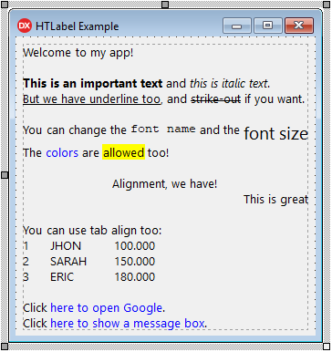

# HTLabel
## Delphi HTML Label component


- [What's New](#whats-new)
- [Component Description](#component-description)
- [Installing](#installing)
- [Component Properties](#component-properties)
- [Events](#events)
- [Procedures/Functions](#proceduresfunctions)
- [Link Tag](#link-tag)
- [Tab Tag](#tab-tag)
- [Transparency (why not?)](#transparency-why-not)
- [Formatted Message Dialog Component](#formatted-message-dialog-component)

## What's New

- 02/07/2019

   - Add Win64 support (library folders changed!) :warning:

## Component Description

This visual component allows you to specify a formatted text in a label, using almost the same sintax used in HTML code.

Here are all possible tags you can use in text:

```
<A[:abc]></A> - Link
<B></B> - Bold
<I></I> - Italic
<U></U> - Underline
<S></S> - Strike out
<FN:abc></FN> - Font Name
<FS:123></FS> - Font Size
<FC:clColor|$999999></FC> - Font Color
<BC:clColor|$999999></BC> - Background Color
<BR> - Line Break
<L></L> - Align Left
<C></C> - Align Center
<R></R> - Aligh Right
<T:123> - Tab
<TF:123> - Tab with aligned break
```

> The tags notation is case-insensitive, so you can use `<B>Text</B>` or `<b>Text</b>`.

> **Note about color notation:**
> When you use `FC` or `BC` tags, the color in hexadecimal value is specifyed by 6 digits, like in HTML notation. If you are getting color from Delphi, please remove the first two zeros of the begining of color code.



## Installing

1. Open **HTLabelPackage** in Delphi.
2. Ensure **Win32** Platform and **Release** config are selected.
3. Then **Build** and **Install**.
4. If you want to use Win64 platform, select this platform and Build again.
5. Add sub-path Win32\Release to the Library paths at Tools\Options using 32-bit option, and if you have compiled to 64 bit platform, add sub-path Win64\Release using 64-bit option.

Supports Delphi XE2..Delphi 10.3 Rio

## Component Properties

`AutoHeight: Boolean` = Auto set height of control when Text property changed

`AutoWidth: Boolean` = Auto set width of control when Text property changed.
If you are using AutoWidth, the text never wraps to a new line unless a line break is specifyed at text or there is a value specifyed in MaxWidth property.

`AutoOpenLink: Boolean` = Open links automatically on click over, without set event OnLinkClick.
This property calls ShellExecute method.

`Color: TColor` = Backgroud color of control

`Font: TFont` = Determines the base font. When no tag is specifyed on text, this base font is used.

`Lines: Integer` = Returns the total lines of text, according to the bounds of control. This property is read-only.

`MaxWidth: Integer` = Specify the maximum width of text, when using AutoWidth property.

`StyleLinkNormal: THTStyleLinkProp` = Properties to format a link when is not selected by mouse.

`StyleLinkHover: THTStyleLinkProp` = Properties to format a link when is selected by mouse.

`Text: String` = The text you want to show at label control. You can use `<BR>` tag to break lines. The Windows default Line Break (#13#10) breaks lines eighter.

`TextHeight: Integer` = Returns the total text height. This property is read-only.

`TextWidth: Integer` = Returns the total text width. This property is read-only.

## Events

```delphi
procedure OnLinkEnter(Sender: TObject; LinkID: Integer; Target: String);
```
This event is fired when the mouse enters a link area

```delphi
procedure OnLinkLeave(Sender: TObject; LinkID: Integer; Target: String);
```
This event is fired when the mouse leaves a link area

```delphi
procedure OnLinkClick(Sender: TObject; LinkID: Integer; Target: String; var Handled: Boolean);
```
This event is fired when a link is left-clicked by the mouse. You can use Handled var to by-pass the AutoOpenLink property (the handled value is False at method start).

```delphi
procedure OnLinkRightClick(Sender: TObject; LinkID: Integer; Target: String; var Handled: Boolean);
```
This event is fired when a link is right-clicked by the mouse. You can use Handled var to by-pass the AutoOpenLink property (the handled value is False at method start).

## Procedures/Functions

```delphi
function IsLinkHover: Boolean;
```
This function returns true when the mouse is over a link

```delphi
function SelectedLinkID: Integer;
```
This function returns the ID of the selected link. This ID is auto generated according by the links sequence in the text. The ID is used to get the target string, that is stored in a internal TStringList.

```delphi
function GetLinkTarget(LinkID: Integer): String;
```
Returns the target string of the link id. The ID is auto generated according by the links sequence in the text.

```delphi
function GetSelectedLinkTarget: String;
```
Returns the target string of selected link. A link is selected when the mouse is over it.

## Link Tag

There are two ways to use link tag:

1. Declaring internal link and the text do display:

   `<a:www.google.com>Open Google Search</a>`

   *This will display: [Open Google Search](http://www.google.com)*

2. Just using the display text:

   `<a>www.google.com</a>`

   *This will display: www.google.com*

> You can use any text as internal link code. Then you can handle this code at OnLinkClick / OnLinkRightClick / OnLinkEnter / OnLinkLeave events, reading `Target` parameter.

## Tab Tag

There are two **tab** tags you can use:

- `<t:nnn>` = Allow you to positioning text exactly on "nnn" position in pixels starting on the left border of component. If the text wraps to a new line, it will be return aligned at left border of component.

- `<tf:nnn>` = The same as above, but if the text wraps to a new line, it will be aligned in the same position as the first line which the tab started. This tag will produce a better visual text alignment.

## Transparency (why not?)

The transparency option is not available for this component, because the text painted on canvas is not static. This means the canvas needs to change eventually, when mouse is over links. So this causes a lot of flickering. Because of that, the transparency is not available at this time.

## Formatted Message Dialog Component

Please, take a look at my Message Dialogs Component that uses this HTML Component to display formatted messages. The component will make much more easy to manage your application messages.

https://github.com/digao-dalpiaz/Dam

Message Dialog Example:


